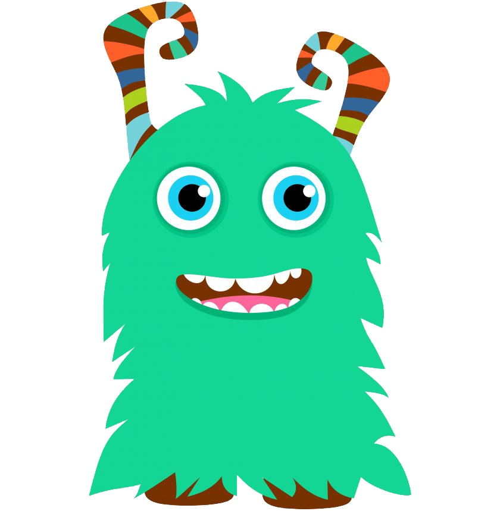

This is a [Next.js](https://nextjs.org/) project bootstrapped with [`create-next-app`](https://github.com/vercel/next.js/tree/canary/packages/create-next-app).

## Getting Started

First, run the development server:

```bash
npm run dev
# or
yarn dev
# or
pnpm dev
# or
bun dev
```

Open [http://localhost:3000](http://localhost:3000) with your browser to see the result.

# Monster University



## Beskrivning
Monster University är ett webbprojekt byggt med Next.js där användare kan hantera en lista av monster. Projektet innehåller grundläggande CRUD-operationer (Create, Read, Update, Delete) för att hantera dessa monster.

### Status
Projektet är för närvarande i utvecklingsfasen och förbättringar och nya funktioner kommer att läggas till kontinuerligt.

## Setup

### Klona projektet
### npm install
### npm run dev

## Bilder på projektet
[bilder på projketet](src/assets/Skärmbild%202024-04-24%20102747.png)

## Figma-skiss

[Länk till Figma-skiss](FIGMA_LÄNK)

## Teknologier
- **Next.js** 
- **React**
- **TypeScript**
- **CSS Modules**
- **JSON**
